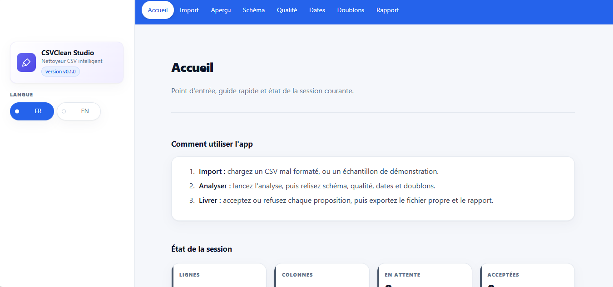

# 🖍️ CSVClean Studio

[English](README.md) | Français

**CSVClean Studio** est une application Streamlit de nettoyage de fichiers CSV mal formés. Elle devine les types des colonnes, normalise dates et textes, signale les incohérences structurelles, détecte les doublons approximatifs et produit un fichier propre accompagné d'un rapport de revue. **L'application ne réécrit jamais une donnée en silence**. Chaque correction est exposée sous forme de **proposition**, avec sa règle, sa confiance et ses valeurs avant/après, et rien n'atteint le fichier exporté sans avoir été accepté.

## Sommaire

- [Fonctionnalités](#fonctionnalites)
- [Lancer en local](#lancer-en-local)
- [Docker](#docker)
- [Demo en ligne](#démo-en-ligne)
- [Utiliser l'application](#utiliser-lapplication)
- [Comment fonctionne le nettoyage](#comment-fonctionne-le-nettoyage)
- [Rapports](#rapports)
- [Données et limites](#donnees-et-limites)
- [Configuration](#configuration)
- [Structure du projet](#structure-du-projet)
- [Licence](#licence)
- [Auteur](#auteur)

## Fonctionnalités

- Import de fichiers CSV jusqu'à 200 Mo. Encodage et délimiteur détectés automatiquement ; au-delà de 200 000 lignes, le fichier est tronqué à l'import avec un avertissement explicite.
- Infération d'un type par colonne (entier, flottant, booléen, catégorie, date, chaîne) avec score de confiance, et correction manuelle depuis la page Schéma.
- Normalisation des dates écrites dans des formats mélangés : dates numériques jour-mois ou mois-jour départagées par un vote au niveau de la colonne, noms de mois en français et en anglais, ISO, et en option epochs Unix ou séries Excel. Sortie au format ISO 8601.
- Normalisation des textes (espaces superflus, whitespace compacté, NFKC Unicode, harmonisation de casse optionnelle) et fusion des valeurs de catégories quasi identiques par clustering flou.
- Signalement des incohérences structurelles : jetons de valeur manquante mélangés, locale numérique ambiguë, colonnes majoritairement vides, colonnes dupliquées.
- Détection de doublons approximatifs par blocage et similarité token-set, en conservant la ligne la plus complète de chaque groupe.
- Revue de chaque proposition avec ses valeurs avant/après, le nom de sa règle et sa confiance, puis acceptation ou refus au cas par cas.
- Export du CSV propre et d'un rapport en Markdown, JSON ou HTML. Le téléchargement du CSV propre reste désactivé tant qu'une colonne de dates contient des valeurs ambiguës ou non analysées.
- Bascule de l'interface entre français et anglais.

## Lancer en local

Sous Windows PowerShell :

    py -3.12 -m venv .venv
    .\.venv\Scripts\Activate.ps1
    python -m pip install -r requirements.txt
    streamlit run app.py

Sous macOS ou Linux :

    python3 -m venv .venv
    . .venv/bin/activate
    python -m pip install -r requirements.txt
    streamlit run app.py

Ouvrez l'URL locale affichée par Streamlit.

## Docker

Construisez et lancez l'image localement :

    docker build -t csv-cleaner .
    docker run --rm -p 8501:8501 csv-cleaner

L'image expose le port 8501 et démarre l'application en mode headless ; le même conteneur tourne sur n'importe quel hôte disposant de Docker, ce qui couvre les déploiements auto-hébergés quand Streamlit Cloud n'est pas une option.

## Démo en ligne

Tester l'application en ligne :

  

## Utiliser l'application

1. Ouvrez Import et déposez un fichier CSV, ou chargez l'un des échantillons de démonstration.
2. Vérifiez l'encodage, le délimiteur et les dimensions détectés, puis réglez les heuristiques si besoin : confiance de type, harmonisation de casse, seuil de fusion des catégories, colonnes clés et seuil de similarité des doublons.
3. Lancez l'analyse.
4. Parcourez Schéma, Qualité, Dates et Doublons. Acceptez ou refusez chaque proposition ; une proposition refusée reste tracée dans le rapport mais n'est jamais appliquée.
5. Ouvrez Rapport pour prévisualiser le fichier propre et télécharger le CSV et le rapport.
6. Utilisez Réinitialiser sur la page Import pour effacer le fichier courant et son analyse de la session.

Le téléchargement du CSV propre est désactivé tant qu'une colonne de dates est bloquée, c'est-à-dire tant qu'elle contient des valeurs que l'analyse n'a pas su résoudre ou une ambiguïté jour-mois / mois-jour qu'elle a refusé de trancher. Les téléchargements du rapport restent disponibles pour pouvoir documenter la situation.

## Comment fonctionne le nettoyage

- Inférence des types. Le fichier est d'abord lu intégralement en texte : pandas ne décide jamais seul. Chaque colonne est notée contre une liste ordonnée de parseurs (booléen, entier, flottant, date, catégorie, chaîne) et un type n'est retenu que si le taux de conversion dépasse le seuil configuré. Les zéros de tête restent des chaînes, car 001 est un identifiant et non un nombre. Une colonne numérique dont le séparateur décimal est ambigu, comme 1.234, reste une chaîne signalée plutôt que d'être devinée.
- Normalisation des dates. Les formats non ambigus sont analysés directement. Les dates numériques à séparateurs sont départagées par un vote au niveau de la colonne : une valeur supérieure à 12 en première position impose jour-mois-année, en seconde position mois-jour-année. Quand aucune position ne dépasse 12, la colonne est laissée telle quelle, signalée comme ambiguë, et l'export du CSV propre est bloqué jusqu'à décision. La conversion des epochs et des séries Excel existe mais reste désactivée par défaut.
- Textes et catégories. Les surfaces sont normalisées d'abord, puis les valeurs de catégories sont regroupées par similarité floue (token set ratio de rapidfuzz). La valeur la plus fréquente d'un groupe devient la forme canonique, si bien que la colonne fusionnée conserve une valeur qui existait déjà dans la donnée.
- Cohérence. Le moteur de cohérence est une liste de checkers à signature uniforme. Ajouter une règle métier consiste à ajouter une fonction à cette liste ; le dispatcheur ne change pas.
- Doublons approximatifs. Les colonnes clés sont normalisées, les lignes sont bloquées par premier caractère pour éviter une comparaison quadratique, et les candidats au-dessus du seuil de similarité sont regroupés en union-find. La ligne conservée de chaque groupe est la plus complète, les égalités étant départagées par l'ordre des lignes : le résultat est déterministe.
- Application. Les changements acceptés sont appliqués à une copie du dataframe, jamais à l'original. Des lignes ne sont supprimées que pour les propositions de dédoublon acceptées, et l'invariant « lignes après = lignes avant moins dédoublons acceptés » est couvert par un test.

## Rapports

Le rapport est un digest canonique de la session : comptes par type et par statut (accepté, en attente, refusé), règles déclenchées, synthèse par colonne avec types inférés et indicateurs, et registre complet des changements, propositions refusées comprises. Il s'exporte en Markdown, JSON ou HTML. L'export JSON est déterministe : clés triées, aucun horodatage, aucun identifiant interne, donc deux exécutions sur les mêmes entrées et les mêmes décisions produisent le même fichier au bit près.

## Données et limites

- Le jeu de données analysé et les propositions vivent en mémoire du processus de la session Streamlit courante. Il n'y a pas de stockage persistant, et recharger la page repart d'une session vierge. Les fichiers téléversés sont envoyés au serveur qui exécute Streamlit et soumis à ses contrôles d'accès et à ses journaux ; ne téléversez pas de données confidentielles sur une instance publique.
- La détection est rule-based et peut produire des faux positifs comme des faux négatifs. L'inférence de type travaille sur les valeurs visibles d'une colonne, la détection de doublons ne compare que les colonnes clés choisies et est plafonnée par bloc avec un avertissement quand un bloc est trop volumineux pour être comparé exhaustivement, et les dates ambiguës sont volontairement laissées inchangées plutôt que devinées. L'application nettoie structure et formats ; elle ne valide pas les règles métier qu'on ne lui a pas données.

## Configuration

| Réglage | Défaut | Rôle |
| --- | --- | --- |
| MAX_ROWS (app.py) | 200000 | Plafond de lignes appliqué à l'import ; au-delà, troncature avec avertissement. |
| Seuil de confiance de type | 0.95 | Taux de conversion minimal pour qu'une colonne reçoive un type. |
| Seuil de fusion des catégories | 90 | Similarité floue au-delà de laquelle des valeurs de catégorie sont fusionnées. |
| Seuil de similarité des doublons | 85 | Token-set ratio au-delà duquel deux lignes forment un groupe de doublons. |
| server.maxUploadSize | 200 MB | Limite de téléversement Streamlit dans .streamlit/config.toml. |

## Structure du projet

| Chemin | Rôle |
| --- | --- |
| app.py | Point d'entrée Streamlit et routage des pages. |
| core/io.py | Détection d'encodage et de délimiteur, chargement CSV sûr. |
| core/infer_types.py | Notation des types par colonne et corrections manuelles. |
| core/normalize_dates.py | Analyse des dates et normalisation ISO. |
| core/normalize_text.py | Normalisation des surfaces et fusion des catégories. |
| core/coherence.py | Checkers de cohérence structurelle. |
| core/duplicates.py | Détection de doublons approximatifs par blocage. |
| core/proposals.py | Agrégation du pipeline et résolution des conflits. |
| core/apply.py | Application des changements acceptés à une copie des données. |
| report/ | Construction du rapport et exports Markdown, JSON, HTML. |
| ui/ et assets/ | Thème, navigation, catalogues i18n, CSS et icônes SVG. |
| tests/ et data/golden/ | Tests unitaires et fixtures golden. |

## Licence

Ce projet est publié sous licence MIT. Voir [LICENSE](LICENSE) pour le texte complet.

## Auteur

Maxime NDACLEU - Data Analyst & BI

