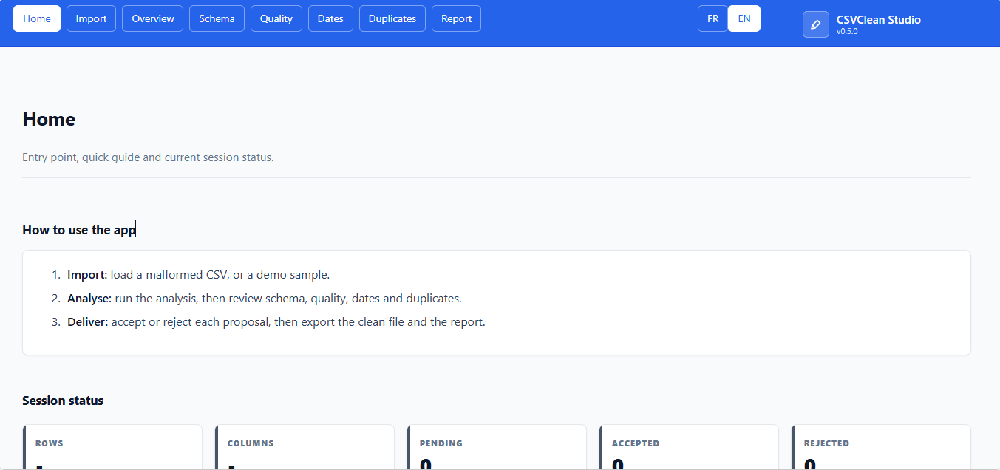

# 🖍️ CSVClean Studio

English | [Français](README.fr.md)

**CSVClean Studio** is a Streamlit application for cleaning malformed CSV files. It infers column types, normalizes dates and text, flags structural incoherences, detects approximate duplicates and produces a clean file together with a review report. **The application never rewrites data silently**. Every correction is exposed as a **proposal** with its rule, its confidence and its before/after values, and nothing reaches the exported file unless it has been accepted.

## Contents

- [Capabilities](#capabilities)
- [Run locally](#run-locally)
- [Docker](#docker)
- [Live demo](#live-demo)
- [Use the application](#use-the-application)
- [How the cleaning works](#how-the-cleaning-works)
- [Reports](#reports)
- [Data handling and limitations](#data-handling-and-limitations)
- [Configuration](#configuration)
- [Project structure](#project-structure)
- [License](#license)
- [Author](#author)

## Capabilities

- Import CSV files up to 200 MB. Encoding and delimiter are detected automatically; files above 200,000 rows are truncated at import with an explicit warning.
- Infer one type per column (integer, float, boolean, category, date, string) with a confidence score, and override it manually from the Schema page.
- Normalize dates written in mixed formats: day-first and month-first numeric dates resolved by a column-level vote, month names in French and English, ISO, and optional Unix epoch or Excel serials. Output is ISO 8601.
- Normalize text surfaces (trim, collapsed whitespace, Unicode NFKC, optional case harmonization) and merge near-identical category values by fuzzy clustering.
- Flag structural incoherences: mixed missing-value tokens, ambiguous numeric locales, columns that are mostly empty, and duplicated columns.
- Detect approximate duplicates by blocking and token-set similarity, keeping the most complete row of each group.
- Review every proposal with its before/after values, rule name and confidence, then accept or reject it individually.
- Export the cleaned CSV and a report as Markdown, JSON or HTML. The clean CSV download stays disabled while a date column contains ambiguous or unparsed values.
- Switch the interface between French and English.

## Run locally

On Windows PowerShell:

    py -3.12 -m venv .venv
    .\.venv\Scripts\Activate.ps1
    python -m pip install -r requirements.txt
    streamlit run app.py

On macOS or Linux:

    python3 -m venv .venv
    . .venv/bin/activate
    python -m pip install -r requirements.txt
    streamlit run app.py

Open the local URL printed by Streamlit.

## Docker

Build and run the image locally:

    docker build -t csv-cleaner .
    docker run --rm -p 8501:8501 csv-cleaner

The image exposes port 8501 and starts the app in headless mode; the same container runs on any host with Docker, which covers self-hosted deployments when Streamlit Cloud is not an option.

## Live demo

Try the app online:

  

## Use the application

1. Open Import and drop a CSV file, or load one of the demo samples.
2. Check the detected encoding, delimiter and shape, then tune the heuristics if needed: type confidence, case harmonization, category merge threshold, duplicate key columns and similarity threshold.
3. Select Run analysis.
4. Review Schema, Quality, Dates and Duplicates. Accept or reject each proposal; a rejected proposal is kept in the report but never applied.
5. Open Report to preview the clean file and download the CSV and the report.
6. Use Reset on the Import page to clear the current file and its analysis from the session.

The clean CSV download is disabled as long as a date column is blocked, that is, as long as it contains values the parser could not resolve or a DMY/MDY ambiguity it refused to guess. The report downloads remain available so the situation can still be documented.

## How the cleaning works

- Type inference. The file is read as text first; pandas never decides alone. Each column is scored against an ordered list of parsers (boolean, integer, float, date, category, string) and a type is kept only when the conversion rate exceeds the configured threshold. Leading zeros stay strings, because 001 is an identifier rather than a number. A numeric column whose decimal separator is ambiguous, such as 1.234, stays a string and is flagged instead of being guessed.
- Date normalization. Unambiguous formats are parsed directly. Numeric dates with separators are resolved by a column-level vote: a value above 12 in the first position forces day-first, a value above 12 in the second forces month-first. When neither position exceeds 12, the column is left untouched, reported as ambiguous, and the clean CSV export is blocked until a decision is taken. Epoch and Excel serial conversion is available but off by default.
- Text and categories. Surfaces are normalized first, then category values are clustered by fuzzy similarity (rapidfuzz token set ratio). The most frequent value of a cluster becomes the canonical form, so the merged column keeps a value that already existed in the data.
- Coherence. The coherence engine is a list of checkers with a uniform signature. Adding a business rule means appending one function to that list; the dispatcher does not change.
- Approximate duplicates. Key columns are normalized, rows are blocked by first character to avoid quadratic comparison, and candidates above the similarity threshold are grouped with union-find. The retained row of each group is the most complete one, ties broken by row order, so the outcome is deterministic.
- Application. Accepted changes are applied to a copy of the dataframe, never to the original. Rows are removed only for accepted dedup proposals, and the invariant rows after equals rows before minus accepted dedup is covered by a test.

## Reports

The report is a canonical digest of the session: counts by kind and by status (accepted, pending, rejected), rules triggered, a per-column summary with inferred types and flags, and the full change ledger, rejected proposals included. It is exported as Markdown, JSON or HTML. The JSON export is deterministic: sorted keys, no timestamps and no internal identifiers, so two runs on the same inputs and the same decisions produce the same file byte for byte.

## Data handling and limitations

- The parsed dataset and the proposals live in the current Streamlit session's process memory. There is no persistent storage, and reloading the page starts a fresh session. Uploaded files are sent to the server running Streamlit and are subject to that host's access controls and logs; do not upload confidential data to a public instance.
- Detection is rule-based and can produce false positives or false negatives. Type inference works on the visible values of a column, duplicate detection compares only the selected key columns and is capped per block with a warning when a block is too large to compare exhaustively, and ambiguous dates are deliberately left unchanged rather than guessed. The application cleans structure and format; it does not validate business rules it was not told about.

## Configuration

| Setting | Default | Purpose |
| --- | --- | --- |
| MAX_ROWS (app.py) | 200000 | Row cap applied at import; larger files are truncated with a warning. |
| Type confidence threshold | 0.95 | Minimum parse success rate for a column to receive a type. |
| Category merge threshold | 90 | Fuzzy similarity above which category values are merged. |
| Duplicate similarity threshold | 85 | Token-set ratio above which two rows form a duplicate group. |
| server.maxUploadSize | 200 MB | Streamlit upload limit in .streamlit/config.toml. |

## Project structure

| Path | Purpose |
| --- | --- |
| app.py | Streamlit entry point and page routing. |
| core/io.py | Encoding and delimiter detection, safe CSV loading. |
| core/infer_types.py | Per-column type scoring and manual overrides. |
| core/normalize_dates.py | Date parsing and ISO normalization. |
| core/normalize_text.py | Text surface normalization and category merging. |
| core/coherence.py | Structural coherence checkers. |
| core/duplicates.py | Approximate duplicate detection by blocking. |
| core/proposals.py | Pipeline aggregation and conflict resolution. |
| core/apply.py | Applies accepted changes to a copy of the data. |
| report/ | Report building and Markdown, JSON, HTML export. |
| ui/ and assets/ | Theme, navigation, i18n catalogs, CSS and SVG icons. |
| tests/ and data/golden/ | Unit tests and golden fixtures. |

## License

This project is licensed under the MIT License. See [LICENSE](LICENSE) for the full terms.

## Author

Maxime NDACLEU - Data Analyst & BI

